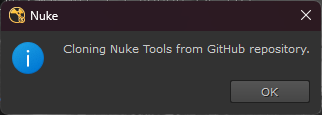
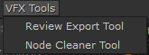

# Nuke Tools Set

A growing collection of Python-based tools designed to improve and simplify daily workflows in **Nuke**.

Whether you're a compositor preparing review shots, or a TD building utilities, this toolkit offers practical, modular solutions you can drop into your ".nuke" folder.

## Features

- Self-installing (via GitHub)
- Modular structure for easy customization
- Suitable for compositors, and technical directors

## Tools included (so far)

[Review Export Tool](https://github.com/Chilanguiux/nuke_tools/tree/main/review_export_tool)

[Node Cleaner Tool](https://github.com/Chilanguiux/nuke_tools/tree/main/node_cleaner_tool)

## Installation (Automatic)

1. Copy "menu.py" into your local "~/.nuke/" folder.
2. Launch Nuke.
3. No manual installation or setup needed. The tool auto-installs from GitHub the first time.

4. The tools will appear under "VFX Tools Menu".

## Disclaimer

These tools are provided "as is", without warranty of any kind, express or implied.
Use them at your own risk. The author assumes no responsibility for any damage, data loss, or unexpected behavior that may result from their use.

That said, they are built with care and tested in real-world Nuke environments.

Gracias!
