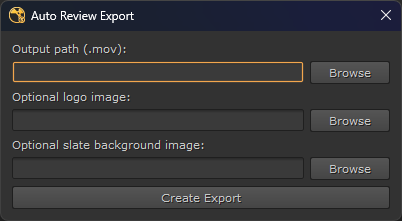
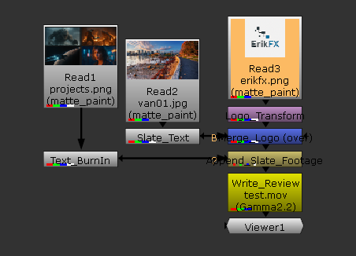

# Auto Review Export Tool for Nuke _Non-Commercial_

**A Nuke tool designed to help new compositors set up a basic review comp quickly and professionally.**

- A customizable **slate** (solid or image)
- **Burn-in text** (shot name, frame)
- An optional **logo** positioned top-right
- Merged slate + footage
- Final output using libx264 codec (compatible with most review pipelines)

## Features

- Works in **Nuke Non-Commercial** (within node limits)
- Minimal and intuitive **PySide UI**
- File pickers for **output path**, **logo**, and **slate background**
- Automatically formats and scales the logo
- Great for **school reviews**, **assignments**, or **learning real comp workflows**

## Usage

Select or create a Read node with your shot

Open the Auto Review Export tool

## Choose

Output .mov path

Optional logo

Optional slate background (solid or image)

**Click Create Export**

The tool builds the comp, adds burn-ins, merges elements, and writes a .mov

# Why This Tool?

Just an extra help especially when preparing shots for dailies or reviews.

# Compatibility

- Nuke Non-Commercial (tested on Nuke 13–16)
- Tested on Windows
- PySide2 and PySide6 fallback

# Credits

Created by **Erik ELizalde**, inspired by real production review workflows and adapted for learning environments.

**Please get in touch if you want to talk about this or any other development I can help you with.**
